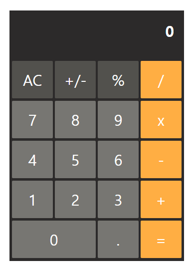

## PREVIEW

## CALCULATOR
A calculator app mimicked iphone's default calculator

 

## VERSION 1.0
- [x] 사칙연산: `+ - * /`
- [x] 퍼센트: `%`
- [x] 부호 토글: `+/-`
- [x] 계산기를 클래스로 구현
- [x] AC 기능: 0 으로 초기화
- [x] 연산자를 클릭할 때마다 결과 업데이트

 

## VERSION 2.0
- [x] C(CE) 기능: 마지막 연산의 숫자를 지우기 (`3+1` → `3+`)
- [x] 버튼 클릭 시 순간적으로 색이 변하는 기능 추가
- [x] `.` 을 여러 번 누르면 계속 추가되는 현상 해결
- [x] 처음부터 `.` 과 숫자를 입력하면 `.xxx` 가 되는 현상 해결
- [x] `0`을 여러 번 입력하면 다시 `0`으로 초기화되는 현상 해결

 

## LESSONS LEARNED

- [x] `Number`와 `String` 함수로 숫자와 문자열 변환하기
- [x] 이벤트 객체를 매개변수로 받아서 `target`속성 활용하기
- [x] Git branch 생성하고 `Pull Request` 해보기
- [x] `includes` 메서드로 문자열 안에 해당 문자가 있는지 확인하기
- [x] `active`로 버튼 클릭 시에 색이 변하도록 하는 CSS 기능
